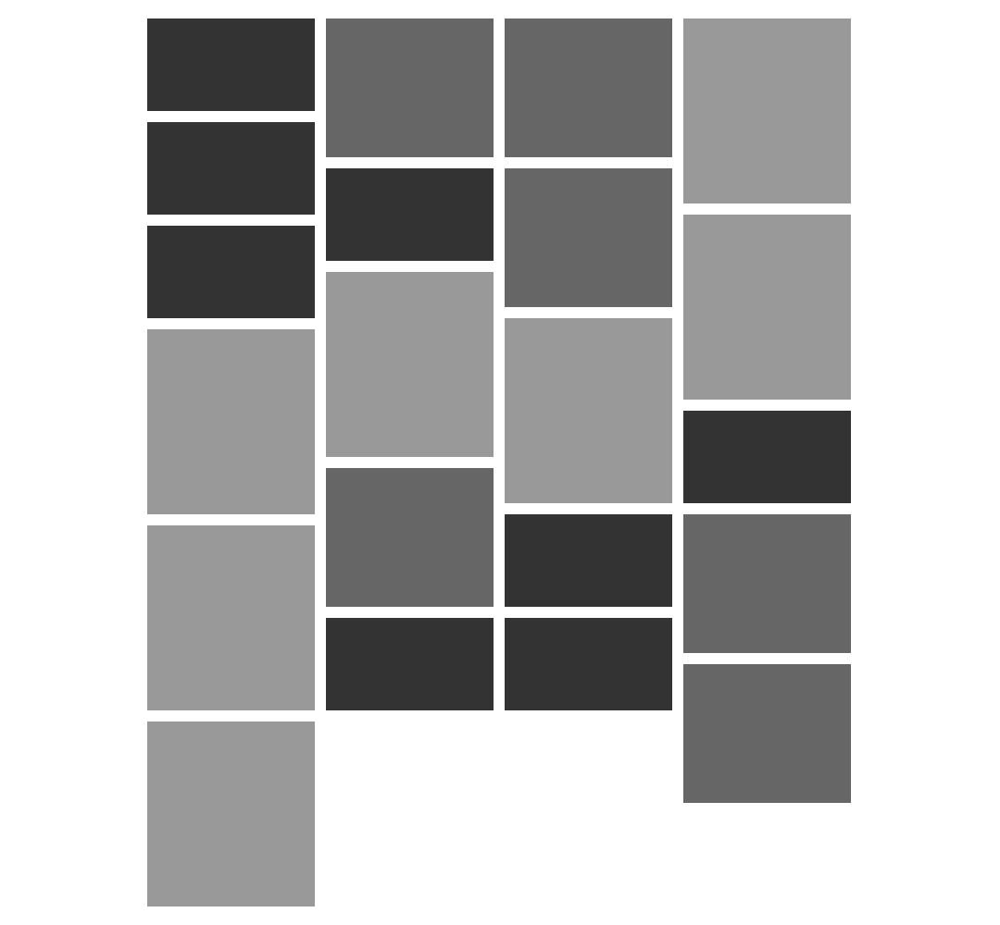

#  Elm Layout
A package that makes it super easy to create grids.



## Usage
For now there are just two styles: `column` and `row`. Both have this signature.
```elm 
column : Columns -> Gutter -> List (Html msg) -> Html msg
```
This should be quite self-explanatory, it takes an `Int` for the amount of colums, a `Float` for the amount of space inbetween the elements and the list of `Html msg` to display.  

## Notes
Flexbox solves a lot of layout issues but the ones in this package either require quite a lot of code or aren't possible.

As this package uses float instead of flexbox both `column` and `row` work in IE9.

## Future 
I'm looking into other interesting ways to layout element on a page, layouts that are hard or impossible to implement with css. Suggestions are welcome.